# Real Estate Native App

Real Estate is a mobile real estate marketplace app built with Expo SDK 54, React Native, Expo Router, Clerk, Supabase, and NativeWind. It lets users browse property listings, search and filter listings, view detailed property pages, save favorites, contact the agent, and view listing locations on a map.

The app also includes an admin listing flow for creating new properties, uploading photos, marking properties as sold, and deleting listings.

## Project Status

The core MVP is complete.

- Authentication is handled with Clerk.
- Supabase stores users, properties, saved listings, and property images.
- Home, search, saved, profile, property details, map, and admin create screens are implemented.
- iOS uses Expo Router native tabs, while Android uses Expo Router tabs.
- The app is configured for Expo SDK 54 with React Native 0.81 and React 19.1.

## Screenshots

Screenshots are stored in `docs/screenshots/` as portrait phone mockups.

| Sign In | Sign Up | Home |
| --- | --- | --- |
| 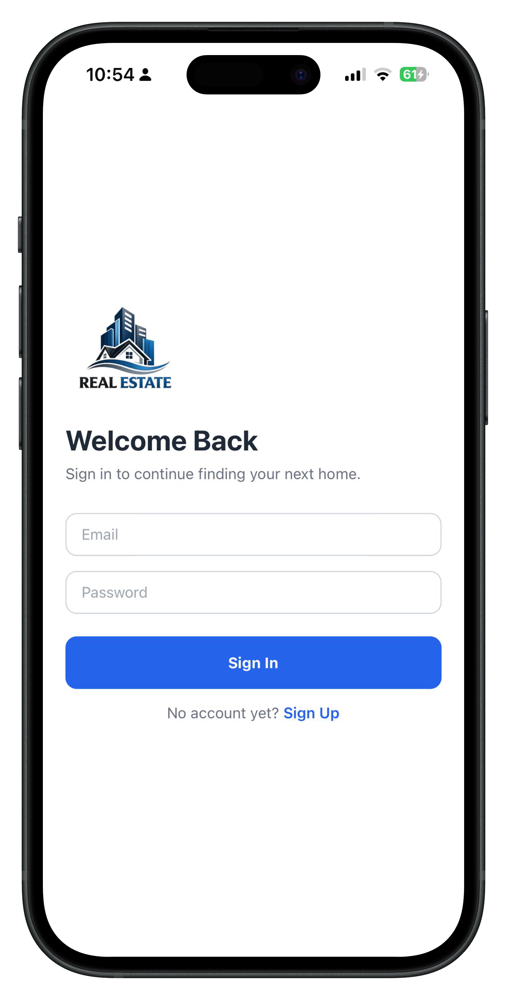 | 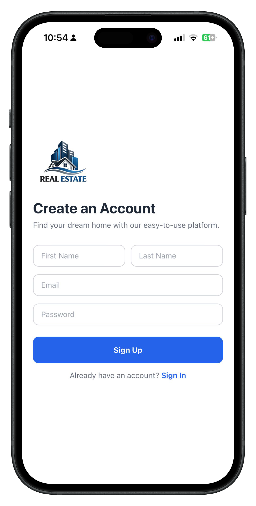 | 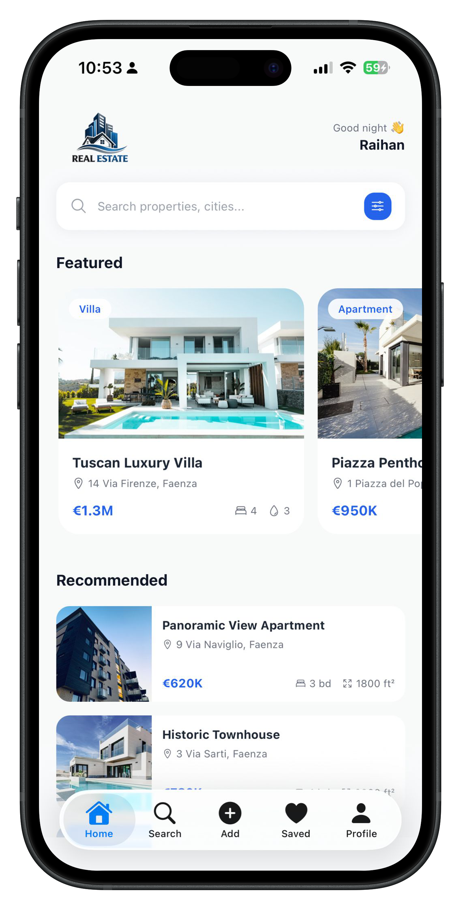 |

| Search | Filters | Add Property |
| --- | --- | --- |
| 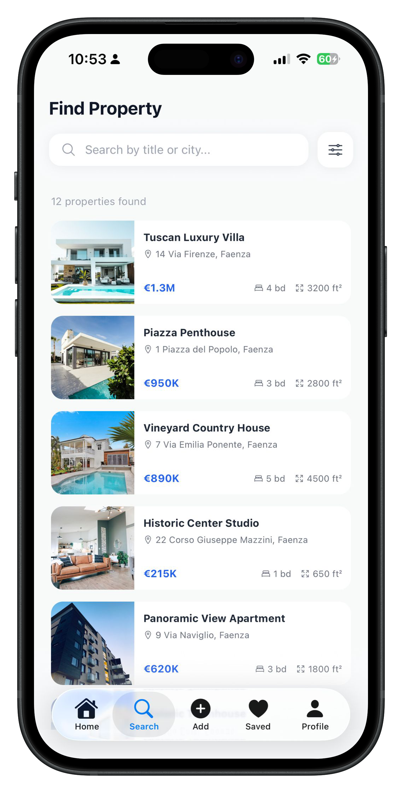 | 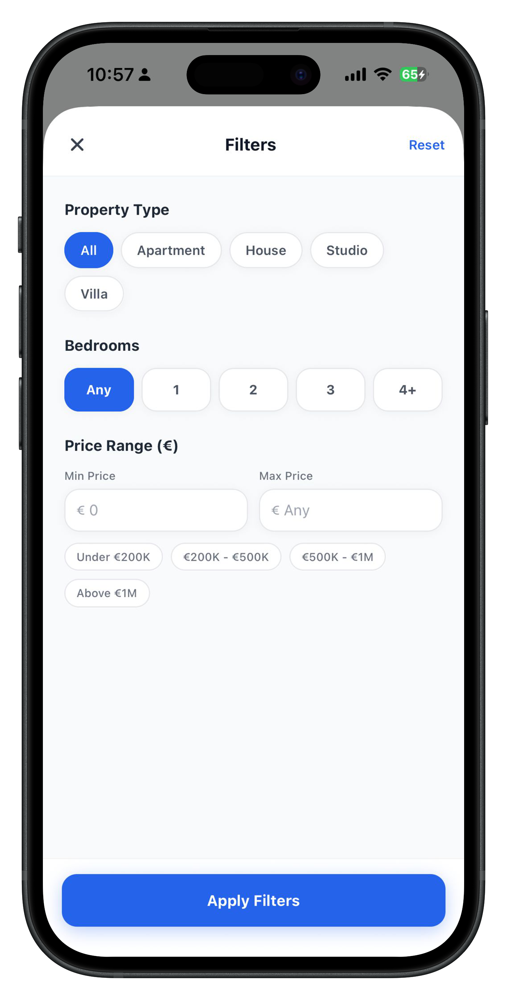 | 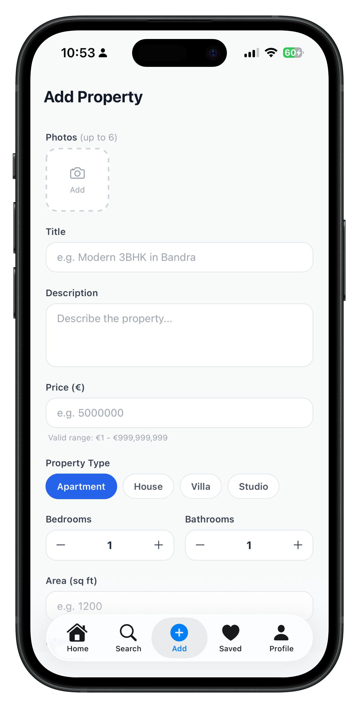 |

| Add Details | Saved | Empty Saved |
| --- | --- | --- |
| 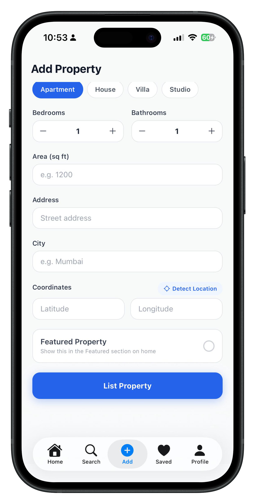 | 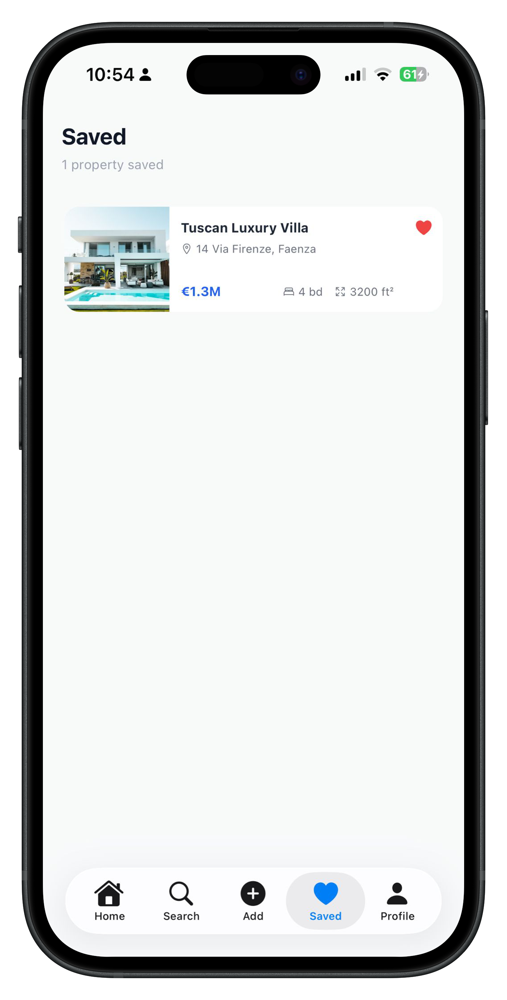 | 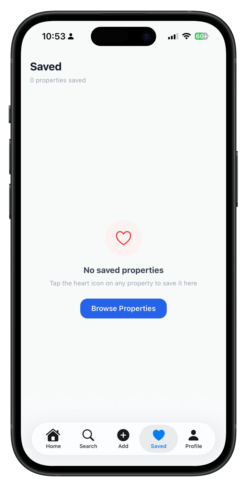 |

| Profile | Property Details | Location And Admin Actions |
| --- | --- | --- |
| 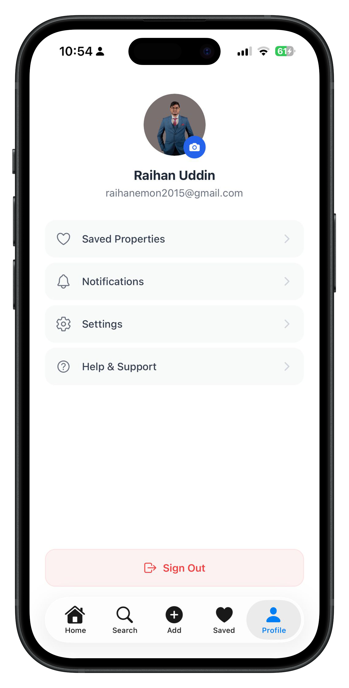 | 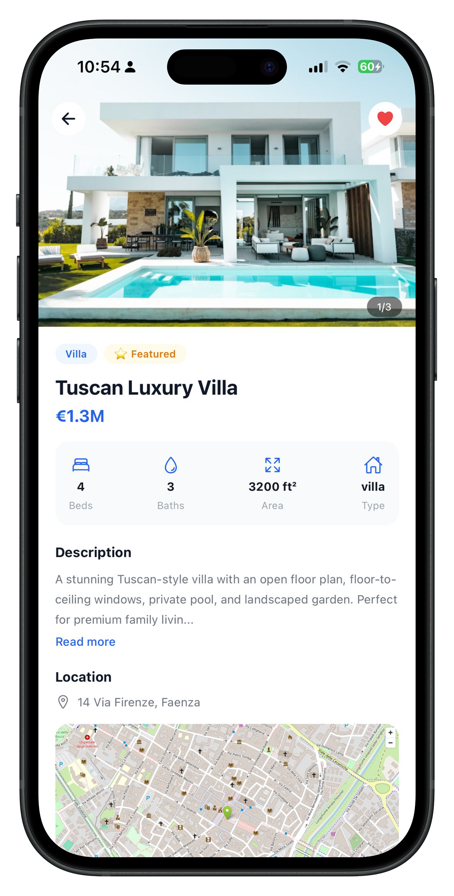 | 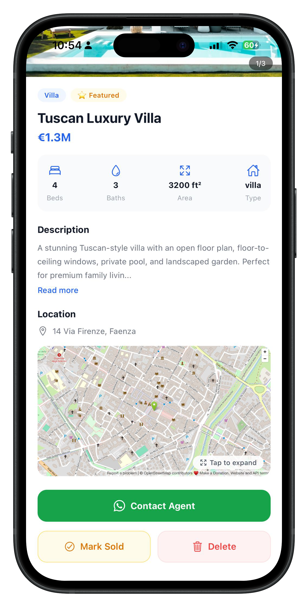 |

## Key Features

### Authentication

- Sign up with first name, last name, email, and password.
- Email verification during sign up.
- Sign in with email and password.
- Supports Clerk MFA flows for email or phone verification codes.
- Secure token storage through `expo-secure-store`.
- Authenticated routes are protected under the root app layout.

### Home

- Shows the logged-in user's greeting.
- Displays featured properties in a horizontal list.
- Displays recommended properties in the main listing feed.
- Property cards show image, title, address, city, price, bedrooms, bathrooms, area, and sold status.

### Search And Filters

- Search by title, city, or address.
- Filter by property type.
- Filter by bedrooms, including a `4+` option.
- Filter by minimum and maximum price.
- Dynamic filter options are loaded from Supabase property data.
- Active filters are shown as removable chips.

### Property Details

- Full property image carousel.
- Tap images to open a full-screen image viewer.
- Price, property type, bedrooms, bathrooms, area, address, city, featured badge, and sold badge.
- Expandable long description.
- Embedded OpenStreetMap location preview.
- Full map screen with a Google Maps shortcut.
- WhatsApp contact action for interested users.

### Saved Properties

- Users can save and unsave properties.
- Saved listings are stored in Supabase per Clerk user.
- The Saved screen lists the current user's saved properties.
- Unsaving from the Saved screen removes the item immediately from the list.

### Admin Features

- Admin status is synced from the Supabase `users` table.
- Admin users see the Add tab.
- Admins can create property listings.
- Create flow supports up to 6 uploaded images.
- Images are uploaded to the Supabase `property-images` storage bucket.
- Location coordinates can be entered manually or detected with `expo-location`.
- Admins can mark a property as sold.
- Admins can delete a property.

### Profile

- Shows the current Clerk user's profile image, name, and email.
- Users can update their profile image using the image picker.
- Includes links for saved properties, notifications placeholder, settings placeholder, help/support email, and sign out.

## Tech Stack

- Expo `~54.0.33`
- React Native `0.81.5`
- React `19.1.0`
- Expo Router `~6.0.23`
- Clerk Expo SDK
- Supabase JS
- NativeWind
- Tailwind CSS
- Zustand
- TypeScript
- Expo Image Picker
- Expo Location
- React Native WebView
- React Native Image Viewing

Expo SDK 54 is tied to React Native 0.81 and React 19.1. Use the versioned Expo docs before changing Expo-related setup:

https://docs.expo.dev/versions/v54.0.0/

## Project Structure

```text
app/
  _layout.tsx                 Root providers: Clerk, keyboard provider, status bar
  index.tsx                   Redirects based on auth state
  (auth)/
    _layout.tsx               Auth route layout
    sign-in.tsx               Clerk sign-in and MFA flow
    sign-up.tsx               Clerk sign-up and email verification flow
  (root)/
    _layout.tsx               Protected authenticated layout and user sync
    (tabs)/
      _layout.tsx             iOS NativeTabs and Android Tabs
      index.tsx               Home screen
      search.tsx              Search and filter screen
      saved.tsx               Saved properties screen
      create.tsx              Admin property creation screen
      profile.tsx             Profile and account actions
    property/
      [id].tsx                Property detail screen
      map.tsx                 Full-screen property map
components/
  FeaturedCard.tsx            Featured property card
  FilterModal.tsx             Search filter modal
  PropertyCard.tsx            Reusable property list card
hooks/
  useSavedProperty.ts         Save and unsave property logic
  useSuperbase.ts             Authenticated Supabase client hook
  useUserSync.ts              Clerk user to Supabase user sync
lib/
  supabase.ts                 Supabase client setup
  utils.ts                    Price and area formatting helpers
store/
  filterStore.ts              Search/filter Zustand store
  userStore.ts                Admin state Zustand store
types/
  index.ts                    Shared TypeScript types
assets/images/                App icons, splash image, logo, favicon
```

## Environment Variables

Create a `.env` file with:

```bash
EXPO_PUBLIC_CLERK_PUBLISHABLE_KEY=your_clerk_publishable_key
EXPO_PUBLIC_SUPABASE_URL=your_supabase_project_url
EXPO_PUBLIC_SUPABASE_KEY=your_supabase_anon_key
```

These are used by Clerk authentication and Supabase data access.

## Supabase Data Model

The app expects these Supabase resources:

- `users` table for Clerk user sync and admin status.
- `properties` table for property listings.
- `saved_properties` table for user favorites.
- `property-images` storage bucket for uploaded listing images.

The `properties` table is expected to include fields such as:

```text
id, title, description, price, type, bedrooms, bathrooms,
area_sqft, address, city, latitude, longitude, images,
is_featured, is_sold, created_at
```

## Requirements

- Node.js 20.19.x or newer for Expo SDK 54
- npm
- Expo CLI through `npx expo`
- Android Studio/emulator or a physical Android device
- macOS with Xcode for iOS simulator testing

## Installation

```bash
npm install
```

## Run The App

Start the Expo development server:

```bash
npm start
```

Run directly on Android:

```bash
npm run android
```

Run directly on iOS:

```bash
npm run ios
```

Run on web:

```bash
npm run web
```

## Available Scripts

```bash
npm start        # Start Expo dev server
npm run android  # Start Expo and open Android target
npm run ios      # Start Expo and open iOS target
npm run web      # Start Expo web
npm run lint     # Run Expo lint
```

Note: `package.json` contains a `reset-project` script, but `scripts/reset-project.js` is not present in this repository.

## Navigation

The app uses Expo Router file-based routing.

- Public auth routes live in `app/(auth)`.
- Protected app routes live in `app/(root)`.
- `app/index.tsx` redirects users based on Clerk auth state.
- `app/(root)/(tabs)/_layout.tsx` defines the main tab navigator.
- iOS uses `expo-router/unstable-native-tabs`.
- Android uses the standard Expo Router `Tabs` layout.

## Styling

NativeWind is configured for utility-first styling in React Native.

- `global.css` includes Tailwind directives.
- `metro.config.js` wraps the Expo Metro config with NativeWind.
- `babel.config.js` enables `nativewind/babel`.
- `tailwind.config.js` scans app and component files.

Example:

```tsx
<SafeAreaView className="flex-1 bg-gray-50">
```

## App Flow

1. A visitor opens the app.
2. `app/index.tsx` checks Clerk auth state.
3. Unauthenticated users go to sign in.
4. Authenticated users enter the protected tab layout.
5. `useUserSync` syncs the Clerk user into Supabase and loads admin status.
6. Normal users can browse, search, view details, contact the agent, and save listings.
7. Admin users can also add, mark sold, and delete listings.

## Notes

- The app uses EUR price formatting.
- `userInterfaceStyle` is set to `light` in `app.json` to keep the native container and screens visually consistent.
- Expo Router native tabs are still marked unstable in SDK 54, so check the Expo SDK 54 docs before changing that API.
